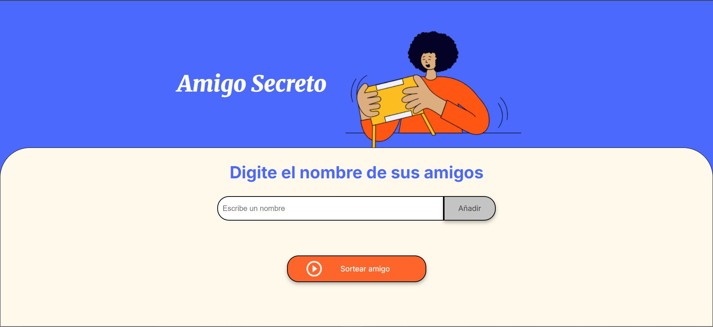

# Amigo Secreto 🎉
Proyecto desarrollado en el curso de **Alura LATAM** como parte de un desafío práctico.

Aplicación web sencilla que permite a los usuarios agregar nombres de amigos a una lista y realizar un sorteo aleatorio para determinar quién es el "amigo secreto".

---

## Características
**Agregar nombres** a una lista mediante un campo de texto y un botón "Añadir".

**Validar entrada** para asegurar que el campo no esté vacío.

**Mostrar la lista** de nombre en pantalla en tiempo real.

**Sorteo aleatorio** para elegir un "amigo secreto" de la lista.

**Interfaz sencilla** y responsive.

---

## Tecnologías utilizadas
- HTML
- CSS
- JavaScript

<a href="https://www.w3.org/html/" target="_blank">  </a>
<a href="https://www.w3schools.com/css/" target="_blank">  </a>
<a href="https://developer.mozilla.org/en-US/docs/Web/JavaScript" target="_blank">  </a>

---

## Instalación y uso
1. Clonar el repositorio:
```bash
git clone https://github.com/monica-rincongallardo/amigo-secreto.git
```

2. Abrir el proyecto:
    - Navega a la carpeta del proyecto
    - Abre el archivo ``` index.html ``` en tu navegador.

---

## Cómo usar la aplicación
1. Escribe un nombre en el campo de texto.
2. Haz clic en "Añadir" para agregarlo a la lista.
3. Una vez tengas todos los nombre, presiona "Sortear amigo".
4. El resultado se mostrará en pantalla.

---

## Vista previa


---

### Autora
Proyecto desarrollado por Mónica Rincón Gallardo Nava como parte de un deasfío del curso de **Alura LATAM**.

